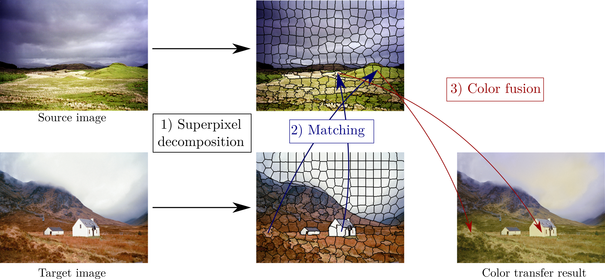

## SCT: Superpixel-based Color Transfer

Implementation of paper:   [PDF](https://hal.archives-ouvertes.fr/hal-01519644/file/Giraud_SCT_ICIP17.pdf)   -   
[Poster](http://rgiraud.vvv.enseirb-matmeca.fr/data/download/pres/Poster_SCT_ICIP_2017.pdf)   - 
[Slides](http://rgiraud.vvv.enseirb-matmeca.fr/data/download/pres/Slides_SCT_ICIP_2017.pdf)
```
@inproceedings{giraud2017superpixel,
  title={Superpixel-based color transfer},
  author={Giraud, R{\'e}mi and Ta, Vinh-Thong and Papadakis, Nicolas},
  booktitle={2017 IEEE International Conference on Image Processing (ICIP)},
  pages={700--704},
  year={2017}
}
```

### Overview

- Source code for SCT color transfer: Superpixel segmentation, constrained matching, color transfer, post-processing 




### Execution

```
run main.m   
```


### License

(C) Rémi Giraud, 2020  
remi.giraud@u-bordeaux.fr  
[https://rgiraud.vvv.enseirb-matmeca.fr](https://rgiraud.vvv.enseirb-matmeca.fr)  
ENSEIRB-MATMECA (Bordeaux INP), Laboratory IMS

This code is free to use, share and modify for any non-commercial purposes.  
Any commercial use is strictly prohibited without the authors' consent.
